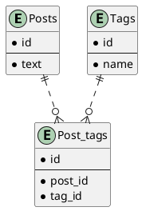

# 課題22 データベース設計のアンチパターンを学ぶ1

## 課題１

### 問題となるテーブル定義
```
TABLE Post {

id: varchar

text: varchar

tags: varchar   -- ("tagA,tagB,tagC"といった値が入る)

}
```

### どんな問題が発生するか

- タグが正規化されていないため、次のような問題が発生しうる
  - 同じタグ名の表記揺れが発生しうる(tagA, tag_A, tag_aなど)
  - タグ名の変更時に、該当するデータを全て書き換える必要がある
  - 重複しうる(tagA, tagB, tagA)

- 検索・追加・削除時に文字列のパースが必要になる
- カンマの入ったタグ名が入った時にエラーが起こりやすい

## 課題２

上記の問題点を解決するようスキーマ設計を行う

### plantUML

Plant UML(Web版)を使ってUML図を作成する
https://plantuml.com/ja/server





