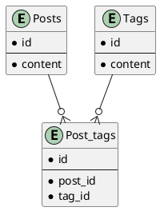

# 課題23 データベース設計のアンチパターンを学ぶ2

## 課題１

### 問題となるテーブル定義
```
TABLE Post {

id: varchar

content: varchar

tag1: varchar

tag2: varchar

tag3: varchar

}


TABLE Tag {

id: varchar

content: varchar

}
```


### どんな問題が発生するか

- 付与できるタグの数が増えるたびにカラムを増やす必要がある
- NULL許容ため検索がしずらい
- tag1が削除される場合に、NULLとなったカラムを埋める必要がある

## 課題２

上記の問題点を解決するようスキーマ設計を行う

### plantUML

Plant UML(Web版)を使ってUML図を作成する
https://plantuml.com/ja/server




** 前回の回答とリレーションは同じ。各テーブルのカラム名を`content`に変更。
