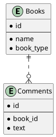
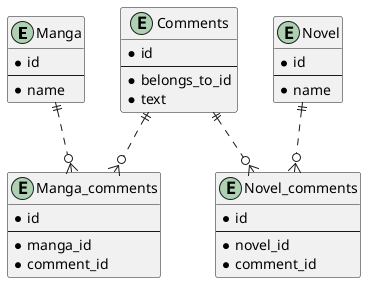

# 課題24 データベース設計のアンチパターンを学ぶ3

## 課題１

### 問題となるテーブル定義
```
(漫画)

TABLE Manga {

id: varchar

name: varchar

}


(小説)

TABLE Novel {

id: varchar

name: varchar

}


(コメント)

TABLE Comment {

id: varchar

text: varchar

belongs_to_id: varchar (ここにはManga.Id、あるいはNovel.Idが入る)

}
```


### どんな問題が発生するか

- Manga.IdとNovel.Idが重複した場合に参照先が分からなくなってしまう
- 重複しないようにオフセット/Prefixをつける方法もあるが、書籍のジャンルが増えるごとに衝突しないように割り振らなければいけない
- idによってリレーション先のテーブルが変わるため、JOINが複雑になる

## 課題２

上記の問題点を解決するようスキーマ設計を行う

### plantUML

Plant UML(Web版)を使ってUML図を作成する
https://plantuml.com/ja/server

### MangaとNovelをBookテーブルに集約する




### MangaとNovelをBookテーブルに集約できない場合



