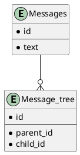

# 課題25 データベース設計のアンチパターンを学ぶ4

## 課題１

### 問題となるテーブル定義
```
TABLE Message {

id: varchar

parent_message_id: varchar

text: varchar

FOREIGN KEY (parent_message_id) REFERENCES Message(id)

}
```


### どんな問題が発生するか

- 最上位の親メッセージの`parent_message_id`がNULLになる
- ３階層以上の子メッセージを取得するために、階層が深くなるだけJOINまたはINクエリを発行する必要がある

## 課題２

上記の問題点を解決するようスキーマ設計を行う

### plantUML

Plant UML(Web版)を使ってUML図を作成する
https://plantuml.com/ja/server




`parent_id`に先祖となるMessage idを入れることで一回のクエリで連なるメッセージを取得できる(閉包テーブル)

デメリットとして、近接したデータ(親子データ)を取得しにくいことが挙げられる

親データからの距離をカラムとして持つと、隣接した親子データも取得しやすくなる

[参考: RDBでツリー構造を実現する](https://www.wantedly.com/companies/tutorial/post_articles/299434)
