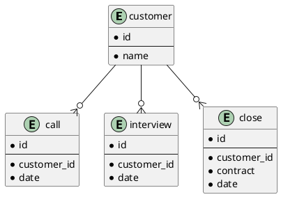

# 課題26 データベース設計のアンチパターンを学ぶ5

## 課題１

### 問題となるテーブル定義
```
TABLE NewCustomer {

id: varchar

telephone: boolean -- 電話をかけたらTRUEになる

metOnce: boolean -- アポで面談したらTRUEになる

metAt: date -- 面談をした日付が入る

closed: boolean -- 成約した

closedAt: boolean -- 成約した日付が入る

}
```


### どんな問題が発生するか

- 顧客テーブルとの重複した管理になりうる
- ステータスがフラグと日付でバラバラのため、統一するべき（電話をかけた日付は要らない？）
- 複数回の電話・面談に対応できない
- 失注した場合のステータスが保持できていない

## 課題２

上記の問題点を解決するようスキーマ設計を行う

### plantUML

Plant UML(Web版)を使ってUML図を作成する
https://plantuml.com/ja/server




- 電話・面談・成約を別テーブルに持ち、リレーションを作成することで複数の履歴も管理できる
- closeのcontractは成約/失注のture/false
- dateはそれぞれ行った日付(カラム名は要検討)
- 「新規顧客」であることを表現するためのフラグを`customer`に持たせても良いかも。
