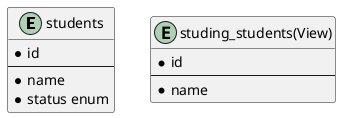
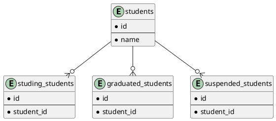

# 課題27 データベース設計のアンチパターンを学ぶ6

## 課題１

### 問題となるテーブル定義
```
TABLE Student {

id: varchar

name: varchar

status: varchar CHECK(status IN ("studying", "graduated", "suspended"))

}
```


### どんな問題が発生するか

- 退学ステータスがない
- 卒業ステータスの学生が累積し、在学中の学生へのアクセスの際に毎回条件検索が必要になる

## 課題２

上記の問題点を解決するようスキーマ設計を行う

### plantUML

Plant UML(Web版)を使ってUML図を作成する
https://plantuml.com/ja/server

#### Viewの活用



- viewにすることで在学の学生へのアクセスを容易にする
- statusのCHECK制約をenumにする

#### テーブルで分ける




- どのテーブルとリレーションがあるかで判断できるので、見通しがよくなる
- テーブルが増えてしまう、ステータスの重複が許容されてしまうデメリットがある
