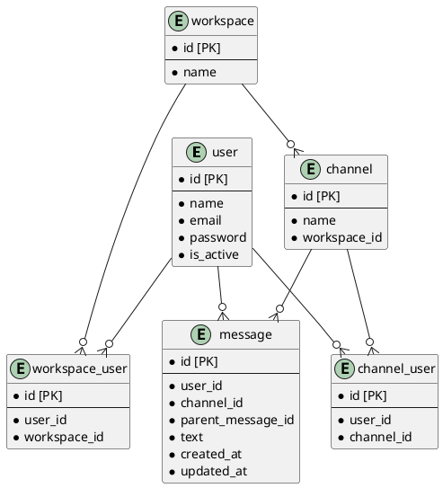
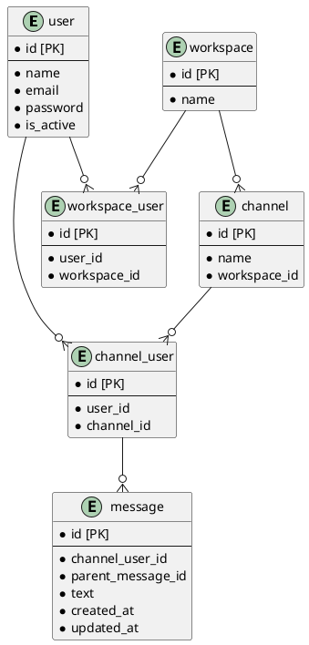

# 課題29 DBモデリング2

## 課題１

### Slackライクなチャットサービスのメッセージを保存するための論理モデルを設計する

#### 仕様
- メッセージ: 
  - 誰が、どのチャネルに、いつ、どんな内容を投稿したのか分かること
- スレッドメッセージ: 
  - 誰が、どのメッセージに、いつ、どんな内容をスレッドとして投稿したのか分かること
- チャネル: 
  - そのチャネルに所属しているユーザにしか、メッセージ・スレッドメッセージが見えないこと
- ユーザ: 
  - ワークスペースに参加・脱退できること
  - チャネルに参加・脱退できること
- 横断機能: 
  - メッセージとスレッドメッセージを横断的に検索できること
  - 参加していないチャネルのメッセージ・スレッドメッセージは検索できないこと

### DBスキーマを設計する

Plant UML(Web版)を使ってUML図を作成する

https://plantuml.com/ja/server

## (代案) channel_userにmessageを紐づける

### メリット
- 構造上channel_userが存在しない限り、messageが作成されないことを保証できる
- channelとuserの交差テーブルの重複を避けられる

### デメリット
- 扱うidが増えるため、複雑になりやすい
- userがchannelから抜けた際にchannel_user_idを削除するとDB不整合が発生する
