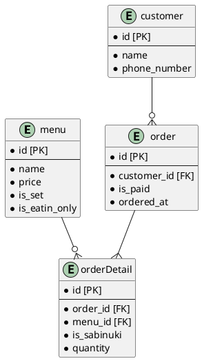

# 課題29 DBモデリング2

## 課題１

[寿司注文表](https://github.com/praha-inc/praha-challenge-templates/blob/master/db/design/sushi.png)

### 注文表のデータを保存するためのDBスキーマを設計する

Plant UML(Web版)を使ってUML図を作成する

https://plantuml.com/ja/server

- 注文ごとにorderテーブルが追加される
- 注文内容はorderDetailに追加される
- 合計の皿数や金額はorderDetailを抽出することで得られる
- 合計金額・皿数はorderテーブルで持っても良いかも
- 寿司とセット商品はmenuテーブルで保持する
- 一部持ち帰りができない商品があるので`is_eatin_only`フラグで管理する

## 課題２

以下の仕様変更がある場合のテーブル設計

### シャリの大小も選べるようになりました

- 値段が変わらない場合

シャリの大きさを`orderDetail`に`shari_size`として持つ

- 値段が変わる場合

シャリの大きさを`orderDetail`に`shari_size`として持ち、販売価格も`selling_price`として持つ

### 人気の寿司ネタを特定したいので、セット商品の売り上げとは別に、寿司ネタが毎月何個売れているのか知る必要が生じた

- セット内容をmenuテーブルを自己参照するmenuDetailテーブルで表現する

## 課題３

その他にどのような仕様変更が考えられるか？

- 応対したスタッフが誰なのかを管理することになりました

  
回答例

- staffテーブルを作成し、orderテーブルを参照する
- 

