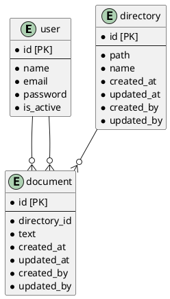

# 課題30 DBモデリング3

## 課題１

### ドキュメント管理システムの論理モデルを設計する

#### 仕様
- ドキュメント
    - いつ、誰が、どんなテキスト情報を保存したのか管理する
    - ドキュメントは必ず何らかのディレクトリに属する

- ディレクトリ
    - 一つ以上のドキュメントを含む階層構造
    - ディレクトリは無制限にサブディレクトリを持つことができる
    - ディレクトリ構造は柔軟に変更可能。ディレクトリが移動してサブディレクトリになることもあり得る

- ユーザ
    - ドキュメントをCRUD（作成、参照、更新、削除）できる
    - ディレクトリをCRUDできる

### DBスキーマを設計する

Plant UML(Web版)を使ってUML図を作成する

https://plantuml.com/ja/server

- 階層構造を表現する方法は複数あるが、経路列挙を用いてみる
- 参考: [階層構造(a.k.a ツリー構造・ディレクトリ構造・フォルダ)をDBでどう設計すべきか](https://teitei-tk.hatenablog.com/entry/2020/11/30/130000)

