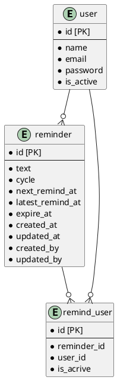

# 課題30 DBモデリング3

## 課題１

### リマインダーアプリpenpenのデータベースを設計する

#### 仕様
- ユーザ
  - 他のユーザ（複数可）宛にリマインダーを設定できる
- リマインダー
  - 送信相手、文面、頻度を指定可能
  - 1時間ごとにバッチが動き、配信が必要なリマインダーを指定されたユーザに配信する
- リマインダーの周期
  - 設定可能な周期は、現時点では以下の4種類
  - 毎日
  - X日おき
  - 毎週X曜日
  - 毎月X日
  - 今後も例えば「2週間に1度」など、配信頻度のパターンは増えることが想定されます。こうした仕様にも対応できるようにしておきましょう！

### DBスキーマを設計する

Plant UML(Web版)を使ってUML図を作成する

https://plantuml.com/ja/server

